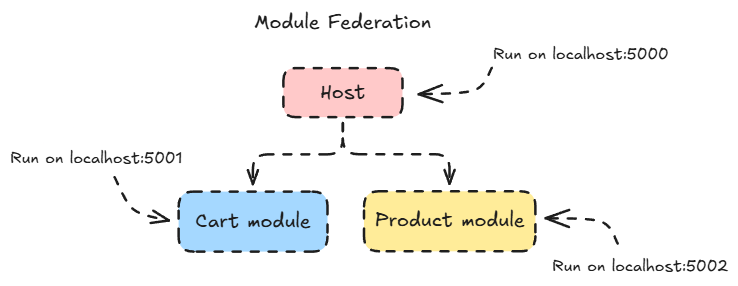

   

# Cross-Framework Micro Frontend with Vite Module Federation

**Cross-framework micro frontend reference implementation** showing how React and Vue applications can work together as one frontend while keeping clear domain ownership, runtime boundaries, and communication contracts.

**React Host · Vue Product Remote · React Cart Remote · Vite Module Federation · Zustand · CustomEvent**

The e-commerce flow is used as a practical use case. The main architecture problem addressed here is:

> **How can React and Vue micro frontends work together, communicate, share selected state, and handle runtime boundaries without creating unnecessary dependencies between domains?**

```text
                         React Host
                            │
                    ┌───────┴────────┐
                    │                │
                    ▼                ▼
              Vue Products       React Cart
                    │                ▲
                    │   cart:add     │
                    └──── Host ──────┘
```

---

<details>
<summary><strong>🎯 The Problem</strong></summary>

A micro frontend architecture becomes more interesting when every domain does not use the same framework.

In this repository:

```text
Host
└── React

Product Domain
└── Vue

Cart Domain
└── React
```

Rendering them together is only the first problem.

When a user clicks **Add to Cart** inside the Vue remote, the event starts in one framework, updates state owned by another remote, and also needs to update UI inside the Host.

```text
Vue Product
    │
    │ Add to Cart
    ▼
React Host
    │
    ▼
Cart State
    │
    ├── React Cart
    └── Host Cart Badge
```

That creates a few architecture questions:

* How can React render a remote written in Vue?
* How should Product communicate with Cart?
* Should Product know directly about Zustand or `remote-cart`?
* Who should own the Cart state?
* How can the Host consume state owned by a remote?
* Who should own routing and application layout?
* How should React clean up a Vue application when the route changes?
* How should loading and remote failures be handled?

This repository demonstrates one practical implementation of those boundaries.

</details>

---

<details>
<summary><strong>🏗️ Architecture Overview</strong></summary>

```text
                             Browser
                                │
                                ▼
                  ┌──────────────────────────┐
                  │        React Host        │
                  │      localhost:3000      │
                  │                          │
                  │   Application Shell      │
                  │   React Router           │
                  │   Suspense / Loading     │
                  │   Error Boundaries       │
                  │   Topbar / Cart Badge    │
                  └────────────┬─────────────┘
                               │
                        Module Federation
                    ┌──────────┴───────────┐
                    │                      │
                    ▼                      ▼
        ┌─────────────────────┐   ┌─────────────────────┐
        │   remote-product    │   │     remote-cart     │
        │        Vue          │   │        React        │
        │   localhost:5002    │   │   localhost:5001    │
        │                     │   │                     │
        │ ProductList         │   │ CartList            │
        │ ProductItem         │   │ CartItem            │
        │ Product API Fetch   │   │ Zustand Store       │
        │ mount() Adapter     │   │ Cart Domain         │
        └──────────┬──────────┘   └──────────▲──────────┘
                   │                         │
                   │ CustomEvent             │
                   │ "cart:add"              │
                   ▼                         │
                window                       │
                   │                         │
                   ▼                         │
           Host ProductsPage                 │
                   │                         │
                   │ addToCart(product)      │
                   └─────────────────────────┘
```

Each application owns a different part of the system:

| App              | Responsibility                                                                               |
| ---------------- | -------------------------------------------------------------------------------------------- |
| `host`           | Application shell, routing, layout, loading states, error boundaries, and remote composition |
| `remote-product` | Product UI, product fetching, and Product behavior                                           |
| `remote-cart`    | Cart UI, Cart actions, and Cart state                                                        |

```text
Host
└── Application concerns

remote-product
└── Product concerns

remote-cart
└── Cart concerns
```

**Implementation:** [Host](./host) · [Remote Product](./remote-product) · [Remote Cart](./remote-cart)

</details>

---

<details>
<summary><strong>📦 Runtime Composition with Module Federation</strong></summary>

The Host registers both remotes through `@module-federation/vite`.

```ts
const federationConfig = federation({
  name: "host",
  remotes: {
    remoteCart: {
      type: "module",
      name: "remoteCart",
      entry: "http://localhost:5001/remoteEntry.js",
    },
    remoteProduct: {
      type: "module",
      name: "remoteProduct",
      entry: "http://localhost:5002/remoteEntry.js",
    },
  },
});
```

**Implementation:** [host/vite.config.ts](./host/vite.config.ts)

The Host can then request modules exposed by those remotes:

```ts
await import("remoteProduct/ProductList");
```

or:

```ts
import("remoteCart/CartList");
```

The basic runtime flow is:

```text
Host
 │
 │ request module
 ▼
remoteEntry.js
 │
 ▼
Federated Module
```

Module Federation is responsible for making the remote module available at runtime.

It does not automatically solve framework integration, state ownership, communication, or lifecycle management. Those concerns are handled separately.

**Remote configurations:**

* [remote-cart/vite.config.js](./remote-cart/vite.config.js)
* [remote-product/vite.config.js](./remote-product/vite.config.js)

</details>

---

<details>
<summary><strong>⚛️ React → React Integration</strong></summary>

`host` and `remote-cart` both use React, so the integration is relatively simple.

The Cart remote exposes its React component and Zustand store:

```ts
export default {
  "./CartList": "./src/components/CartList.tsx",
  "./useCartStore": "./src/stores/useCartStore.ts",
};
```

**Implementation:** [remote-cart/exposes.config.ts](./remote-cart/exposes.config.ts)

The Host loads `CartList` with `React.lazy()`:

```tsx
import { lazy } from "react";

const Cart = lazy(() => import("remoteCart/CartList"));

export default Cart;
```

**Implementation:** [host/src/pages/Cart.tsx](./host/src/pages/Cart.tsx)

The flow is:

```text
React Host
    │
    │ React.lazy()
    ▼
remoteCart/CartList
    │
    ▼
React Component
```

Because both sides use React, the exposed module can be treated like another lazy React component.

</details>

---

<details>
<summary><strong>🟢 React → Vue Integration</strong></summary>

`remote-product` uses Vue while the Host uses React.

A Vue component cannot be rendered directly as a React component:

```tsx
<ProductList />
```

Instead of exposing `ProductList.vue` directly, the remote exposes a small adapter:

```js
export default {
  "./ProductList": "./src/components/renderProductList.js",
};
```

**Implementation:** [remote-product/exposes.config.js](./remote-product/exposes.config.js)

The adapter exposes a `mount()` function:

```js
import baseMount from "../utils/bootstrap.js";
import ProductList from "./ProductList.vue";

export const mount = (rootElement, props = {}) =>
  baseMount(ProductList, rootElement, props);
```

**Implementation:** [remote-product/src/components/renderProductList.js](./remote-product/src/components/renderProductList.js)

Vue-specific lifecycle logic stays inside the remote:

```js
import { createApp } from "vue";

const mount = (
  RenderElement,
  rootElement,
  props,
) => {
  const app = createApp(RenderElement, props);

  app.mount(rootElement);

  return () => {
    app.unmount();
  };
};

export default mount;
```

**Implementation:** [remote-product/src/utils/bootstrap.js](./remote-product/src/utils/bootstrap.js)

The public contract is intentionally small:

```text
mount(rootElement)
       ↓
Vue starts
       ↓
return unmount()
```

The Host only needs a DOM container:

```tsx
const containerRef = useRef<HTMLDivElement>(null);
```

Then it loads the federated module:

```ts
const ProductList =
  await import("remoteProduct/ProductList");
```

and passes the container to Vue:

```ts
unmount = ProductList.mount(container);
```

**Implementation:** [host/src/pages/Products.tsx](./host/src/pages/Products.tsx)

The boundary looks like this:

```text
React Host
    │
    │ DOM Element
    ▼
mount(container)
    │
    ▼
Vue createApp()
    │
    ▼
ProductList.vue
```

Module Federation handles **where the module comes from**.

The `mount()` contract handles **how React and Vue work together**.

</details>

---

<details>
<summary><strong>♻️ Cross-Framework Lifecycle</strong></summary>

Mounting Vue inside React is only half of the integration.

React also needs to tell Vue when its DOM container is being removed.

The Vue bootstrap returns a cleanup function:

```js
return () => {
  app.unmount();
};
```

**Implementation:** [remote-product/src/utils/bootstrap.js](./remote-product/src/utils/bootstrap.js)

The React Host stores that function:

```ts
let unmount: (() => void) | undefined;
```

and calls it during `useEffect` cleanup:

```ts
return () => {
  if (unmount) {
    unmount();
  }
};
```

**Implementation:** [host/src/pages/Products.tsx](./host/src/pages/Products.tsx)

The lifecycle becomes:

```text
React ProductsPage mounts
        ↓
Load remoteProduct/ProductList
        ↓
ProductList.mount(container)
        ↓
Vue createApp()
        ↓
Vue app.mount()

React ProductsPage unmounts
        ↓
useEffect cleanup
        ↓
Vue app.unmount()
```

Vue still owns its framework lifecycle. React only controls when that lifecycle starts and ends.

</details>

---

<details>
<summary><strong>📡 Product → Cart Communication</strong></summary>

When a user clicks **Add to Cart** inside the Vue remote, Product needs to send that intent outside its own domain.

`remote-product` does not import Zustand or `remote-cart` directly.

Instead, it publishes a browser `CustomEvent`:

```js
const event = new CustomEvent("cart:add", {
  detail: toRaw(props.item),
});

window.dispatchEvent(event);
```

**Implementation:** [remote-product/src/components/ProductItem.vue](./remote-product/src/components/ProductItem.vue)

The event contract stays simple:

```text
Event
└── cart:add

Payload
└── Product

Publisher
└── remote-product

Consumer
└── Host
```

The Host listens for the event:

```ts
window.addEventListener(
  "cart:add",
  handleAddToCart as unknown as EventListener,
);
```

The listener is also cleaned up when the page unmounts:

```ts
window.removeEventListener(
  "cart:add",
  handleAddToCart as unknown as EventListener,
);
```

The Host then translates the event into a Cart action:

```ts
const handleAddToCart = useEffectEvent(
  (event: Record<string, unknown>) => {
    const product = event.detail as Product;

    addToCart(product);
  },
);
```

**Implementation:** [host/src/pages/Products.tsx](./host/src/pages/Products.tsx)

The flow becomes:

```text
Vue Product
    │
    │ cart:add
    ▼
window
    │
    ▼
React Host
    │
    │ addToCart()
    ▼
Cart Store
```

`remote-product` does not need to know about:

```text
Zustand
React
CartList
remote-cart
Topbar
```

It only publishes the user intent.

The Host decides how that event connects to the rest of the application.

</details>

---

<details>
<summary><strong>🗃️ Sharing Cart State with Zustand</strong></summary>

The Cart state is created and owned by `remote-cart`.

```ts
const useCartStore = create<CartState>()((set) => ({
  cart: [],

  addToCart: (product) =>
    set((state) => {
      const existingItem = state.cart.find(
        (item) => item.id === product.id,
      );

      if (existingItem) {
        return {
          cart: state.cart.map((item) =>
            item.id === product.id
              ? {
                  ...item,
                  quantity: item.quantity + 1,
                }
              : item,
          ),
        };
      }

      return {
        cart: [
          ...state.cart,
          {
            ...product,
            quantity: 1,
          },
        ],
      };
    }),

  clearCart: () =>
    set({
      cart: [],
    }),
}));
```

**Implementation:** [remote-cart/src/stores/useCartStore.ts](./remote-cart/src/stores/useCartStore.ts)

The store is exposed through Module Federation:

```ts
export default {
  "./CartList": "./src/components/CartList.tsx",
  "./useCartStore": "./src/stores/useCartStore.ts",
};
```

**Implementation:** [remote-cart/exposes.config.ts](./remote-cart/exposes.config.ts)

The Host consumes the same federated store:

```ts
import remoteUseCartStore
  from "remoteCart/useCartStore";

export const useCartStore =
  remoteUseCartStore as UseBoundStore<
    StoreApi<CartState>
  >;
```

**Implementation:** [host/src/stores/useCartStore.ts](./host/src/stores/useCartStore.ts)

The important detail is that the Host does not call `create()` again.

```text
remote-cart
     │
     │ create()
     ▼
Zustand Store
     │
     │ expose
     ▼
remoteCart/useCartStore
     │
     ├──────────────┐
     ▼              ▼
Host Topbar     ProductsPage
```

The Cart remote also consumes the store internally:

```tsx
const { cart, clearCart } = useCartStore();
```

**Implementation:** [remote-cart/src/components/CartList.tsx](./remote-cart/src/components/CartList.tsx)

This keeps state ownership clear:

```text
remote-cart
└── owns Cart state

Host
└── consumes Cart state
```

The state is shared, but the domain still has one clear owner.

</details>

---

<details>
<summary><strong>🛒 Complete Add-to-Cart Flow</strong></summary>

This is the full flow when a user clicks **Add to Cart**:

```text
┌──────────────────────────┐
│      remote-product      │
│           Vue            │
│                          │
│      ProductItem.vue     │
└────────────┬─────────────┘
             │
             │ click
             ▼
       Add to Cart
             │
             ▼
   CustomEvent("cart:add")
             │
             ▼
           window
             │
             ▼
┌──────────────────────────┐
│        React Host        │
│                          │
│      ProductsPage        │
└────────────┬─────────────┘
             │
             │ event.detail
             ▼
       addToCart(product)
             │
             ▼
┌──────────────────────────┐
│       remote-cart        │
│                          │
│      Zustand Store       │
└────────────┬─────────────┘
             │
        state update
             │
      ┌──────┴──────┐
      │             │
      ▼             ▼
 Host Topbar     CartList
 Cart Badge      Cart Page
```

**Relevant implementations:**

* [Product event publisher](./remote-product/src/components/ProductItem.vue)
* [Host event listener](./host/src/pages/Products.tsx)
* [Cart Zustand store](./remote-cart/src/stores/useCartStore.ts)
* [Host cart badge](./host/src/components/layout/Topbar.tsx)
* [Cart UI](./remote-cart/src/components/CartList.tsx)

Each mechanism solves a different problem:

| Problem                | Solution          |
| ---------------------- | ----------------- |
| Runtime module loading | Module Federation |
| React remote rendering | `React.lazy()`    |
| Vue remote rendering   | `mount()` adapter |
| Product communication  | `CustomEvent`     |
| Cart state             | Zustand           |
| Sharing Cart state     | Federated store   |

</details>

---

<details>
<summary><strong>⏳ Loading State</strong></summary>

The Host owns the loading experience for routed content.

```tsx
<Suspense fallback={<Loading />}>
  <Outlet />
</Suspense>
```

**Implementation:** [host/src/components/layout/Layout.tsx](./host/src/components/layout/Layout.tsx)

The fallback is kept in a small reusable component:

```tsx
export default function Loading() {
  const classes = useStyles();

  return (
    <div className={classes.container}>
      <p className={classes.text}>
        Prepare your content ...
      </p>
    </div>
  );
}
```

**Implementation:** [host/src/components/Loading.tsx](./host/src/components/Loading.tsx)

The basic idea is:

```text
Remote is still loading
        ↓
     Suspense
        ↓
     Loading UI
```

Loading and failure are treated as different states.

```text
Still loading
     ↓
Loading UI

Failed to load
     ↓
Error UI
```

</details>

---

<details>
<summary><strong>🛡️ Remote Failure Isolation</strong></summary>

Runtime-loaded remotes can fail independently from the Host.

Each remote route has its own route-level error boundary:

```tsx
export const routes = createBrowserRouter([
  {
    path: "/",
    Component: Layout,
    children: [
      {
        index: true,
        Component: Page.Products,
        ErrorBoundary: ProductErrorBoundary,
      },
      {
        path: "cart",
        Component: Page.Cart,
        ErrorBoundary: CartErrorBoundary,
      },
    ],
  },
]);
```

**Implementation:** [host/src/routes.ts](./host/src/routes.ts)

Both boundaries are generated from the same component factory:

```tsx
function createRemoteErrorBoundary(name: string) {
  return function RemoteErrorBoundary() {
    const error = useRouteError();

    console.error(`${name} remote failed`, error);

    return (
      <section>
        <h2>{name} unavailable</h2>
        <p>
          We couldn't load the {name.toLowerCase()} module.
        </p>

        <button
          onClick={() => window.location.reload()}
        >
          Retry
        </button>
      </section>
    );
  };
}

export const ProductErrorBoundary =
  createRemoteErrorBoundary("Product");

export const CartErrorBoundary =
  createRemoteErrorBoundary("Cart");
```

**Implementation:** [host/src/components/ErrorBoundary.tsx](./host/src/components/ErrorBoundary.tsx)

The intended boundary is:

```text
Product fails
     ↓
Product fallback

Cart fails
     ↓
Cart fallback
```

instead of:

```text
One remote fails
       ↓
Entire shell crashes
```

There is one important difference between both remotes.

`remote-cart` is loaded with:

```tsx
lazy(() => import("remoteCart/CartList"));
```

so its rejected lazy import naturally participates in React's render and route error flow.

`remote-product` is loaded manually inside an Effect:

```ts
await import("remoteProduct/ProductList");
```

A rejected Promise inside that Effect needs to be surfaced back into React's render flow before `ProductErrorBoundary` can handle it.

```text
Product import fails
        ↓
async import rejects
        ↓
surface error to React
        ↓
ProductErrorBoundary
```

This is one of the extra integration details that comes with manually mounting a cross-framework remote.

</details>

---

<details>
<summary><strong>🧭 Routing & Application Shell</strong></summary>

Application-level routing stays inside the Host.

```tsx
export const routes = createBrowserRouter([
  {
    path: "/",
    Component: Layout,
    children: [
      {
        index: true,
        Component: Page.Products,
        ErrorBoundary: ProductErrorBoundary,
      },
      {
        path: "cart",
        Component: Page.Cart,
        ErrorBoundary: CartErrorBoundary,
      },
    ],
  },
]);
```

**Implementation:** [host/src/routes.ts](./host/src/routes.ts)

The route structure is:

```text
/
├── Products
│   ├── Vue Remote
│   └── ProductErrorBoundary
│
└── /cart
    ├── React Remote
    └── CartErrorBoundary
```

The Host also owns the shared application layout:

```tsx
<div className={classes.layout}>
  <Sidebar />

  <main className={classes.main}>
    <Topbar />

    <section className={classes.body}>
      <Suspense fallback={<Loading />}>
        <Outlet />
      </Suspense>
    </section>
  </main>
</div>
```

**Implementation:** [host/src/components/layout/Layout.tsx](./host/src/components/layout/Layout.tsx)

The responsibility stays simple:

```text
Host
├── Routing
├── Layout
├── Navigation
├── Loading boundary
├── Error boundaries
└── Remote composition

Remotes
└── Domain functionality
```

The Host decides **where** a domain appears in the final application.

The remote decides **how** that domain works internally.

</details>

---

<details>
<summary><strong>🔗 Shared Dependencies</strong></summary>

React is shared between `host` and `remote-cart`.

```ts
shared: {
  react: {
    singleton: true,
    requiredVersion: dependencies.react,
  },
  "react-dom": {
    singleton: true,
    requiredVersion: dependencies["react-dom"],
  },
}
```

**Implementation:** [host/vite.config.ts](./host/vite.config.ts) · [remote-cart/vite.config.js](./remote-cart/vite.config.js)

The Vue remote shares its Vue runtime separately:

```ts
shared: {
  vue: {
    singleton: true,
    requiredVersion: dependencies.vue,
  },
}
```

**Implementation:** [remote-product/vite.config.js](./remote-product/vite.config.js)

Conceptually:

```text
React Runtime
├── Host
└── remote-cart

Vue Runtime
└── remote-product
```

The architecture does not require every micro frontend to use the same framework.

What matters is that each framework meets the others through a clear contract.

</details>

---

<details>
<summary><strong>🧠 Why I Chose These Boundaries</strong></summary>

### Why does the Host own routing?

Routing represents the final application, not one specific business domain.

```text
Host
└── Application navigation

Remotes
└── Domain functionality
```

**Implementation:** [host/src/routes.ts](./host/src/routes.ts)

### Why does Vue expose `mount()`?

Because a Vue component is not a React component.

Instead of making React understand Vue internals, the contract stays small:

```text
mount(element)
      ↓
Vue starts

unmount()
      ↓
Vue cleans up
```

**Implementation:** [remote-product/src/utils/bootstrap.js](./remote-product/src/utils/bootstrap.js)

### Why use `CustomEvent`?

Product only needs to publish user intent.

It does not need to know how the Cart domain stores its state.

Instead of:

```text
Product
    ↓
import Cart Store
    ↓
call Zustand directly
```

the flow becomes:

```text
Product
    ↓
cart:add
    ↓
Host
    ↓
Cart action
```

**Implementation:** [ProductItem.vue](./remote-product/src/components/ProductItem.vue) · [Products.tsx](./host/src/pages/Products.tsx)

### Why does `remote-cart` own Zustand?

Because the state belongs to the Cart domain.

```text
remote-cart
└── owns state

host
└── consumes state
```

The Host needing a Cart badge does not mean it should own the full Cart domain.

**Implementation:** [remote-cart/src/stores/useCartStore.ts](./remote-cart/src/stores/useCartStore.ts)

### Why does the Host own error boundaries?

Because the Host composes the final user experience.

The remote focuses on its domain implementation. The Host decides what the user sees when that domain cannot be rendered.

```text
Remote
└── Domain implementation

Host
└── Failure experience
```

**Implementation:** [host/src/components/ErrorBoundary.tsx](./host/src/components/ErrorBoundary.tsx)

</details>

---

<details>
<summary><strong>⚖️ Trade-offs & Current Limitations</strong></summary>

The implementation keeps several trade-offs visible instead of hiding them behind additional abstractions.

### Event contracts are string-based

Product and Host currently agree on:

```text
cart:add
```

This keeps communication simple, but larger applications need stronger conventions around event names and payload contracts.

**Implementation:** [ProductItem.vue](./remote-product/src/components/ProductItem.vue) · [Products.tsx](./host/src/pages/Products.tsx)

### Cart types currently exist in more than one place

The Cart implementation lives in `remote-cart`, while the Host also defines the TypeScript contract it expects from that remote.

```ts
export interface CartState {
  cart: Product[];

  addToCart: (
    product: Omit<Product, "quantity">,
  ) => void;

  increaseQuantity: (
    productId: number,
  ) => void;

  decreaseQuantity: (
    productId: number,
  ) => void;

  removeItem: (
    productId: number,
  ) => void;

  clearCart: () => void;
}
```

If the remote contract changes without the Host type changing, both definitions can drift apart.

**Implementation:** [host/src/stores/useCartStore.ts](./host/src/stores/useCartStore.ts) · [remote-cart/src/stores/useCartStore.ts](./remote-cart/src/stores/useCartStore.ts)

### Browser events use a global scope

Communication currently goes through:

```js
window.dispatchEvent(event);
```

This keeps the event framework-independent, but naming becomes more important as the number of events grows.

### Cross-framework async errors need explicit handling

`remote-product` is loaded inside an Effect instead of through `React.lazy()`:

```ts
await import("remoteProduct/ProductList");
```

A rejected asynchronous import needs to be surfaced into React's render flow before a route Error Boundary can handle it.

This requires a little more integration work than a React remote consumed through `React.lazy()`.

### Remote availability becomes a runtime concern

The Host expects:

```text
http://localhost:5001/remoteEntry.js
http://localhost:5002/remoteEntry.js
```

If one remote is unavailable, that domain cannot be loaded.

Runtime composition therefore makes loading and failure handling part of the application architecture.

</details>

---

<details>
<summary><strong>📁 Project Structure</strong></summary>

```text
module-federation-example/
├── host/
│   ├── src/
│   │   ├── components/
│   │   │   ├── layout/
│   │   │   │   ├── Layout.tsx
│   │   │   │   ├── Sidebar.tsx
│   │   │   │   └── Topbar.tsx
│   │   │   ├── ErrorBoundary.tsx
│   │   │   └── Loading.tsx
│   │   ├── pages/
│   │   │   ├── Products.tsx
│   │   │   └── Cart.tsx
│   │   ├── stores/
│   │   │   └── useCartStore.ts
│   │   └── routes.ts
│   └── vite.config.ts
│
├── remote-product/
│   ├── src/
│   │   ├── components/
│   │   │   ├── ProductList.vue
│   │   │   ├── ProductItem.vue
│   │   │   └── renderProductList.js
│   │   └── utils/
│   │       └── bootstrap.js
│   ├── exposes.config.js
│   └── vite.config.js
│
├── remote-cart/
│   ├── src/
│   │   ├── components/
│   │   │   ├── CartList.tsx
│   │   │   └── CartItem.tsx
│   │   └── stores/
│   │       └── useCartStore.ts
│   ├── exposes.config.ts
│   └── vite.config.js
│
└── docs/
```

**Quick links:**

* [Host](./host)
* [Remote Product](./remote-product)
* [Remote Cart](./remote-cart)
* [Documentation](./docs)

</details>

---

<details>
<summary><strong>💻 Running Locally</strong></summary>

Each application runs independently:

| Application    |   Port |
| -------------- | -----: |
| Host           | `5000` |
| Remote Cart    | `5001` |
| Remote Product | `5002` |

Runtime topology:

```text
remote-cart
└── localhost:5001

remote-product
└── localhost:5002

host
└── localhost:5000
```

The Host expects these remote entries:

```text
http://localhost:5001/remoteEntry.js
http://localhost:5002/remoteEntry.js
```

Start both remotes and then run the Host.

Open:

```text
http://localhost:3000
```

</details>

---

<details>
<summary><strong>📚 What I Learned</strong></summary>

### Module Federation solves module availability, not framework interoperability

Module Federation can make a Vue module available to React:

```text
Module Federation
       ↓
Module available
```

but React still needs an integration contract to render it:

```text
mount()
   ↓
Vue application
```

### Composition and communication are different problems

```text
Module Federation
└── Module composition

mount()
└── Cross-framework rendering

CustomEvent
└── Communication

Zustand
└── Cart state

Suspense
└── Loading state

ErrorBoundary
└── Failure handling
```

Each mechanism solves a different concern.

### Shared state can still have one clear owner

```text
Cart State
└── remote-cart
```

The Host can consume that state without recreating or owning it.

### Cross-framework cleanup is part of the integration

```text
React mount
    ↓
Vue mount

React cleanup
    ↓
Vue unmount
```

Mounting another framework is only one part of the problem. Its lifecycle also needs to be cleaned up correctly.

### Runtime composition also introduces runtime failure

```text
Remote available
      ↓
Render domain

Remote unavailable
      ↓
Fallback UI
```

Once frontend modules are loaded independently at runtime, availability becomes part of the frontend architecture.

### Framework choice is not the main boundary

React and Vue can work together.

The more important questions are:

```text
Who owns this behavior?
Who owns this state?
Who is allowed to know about whom?
How do they communicate?
What happens when one domain fails?
```

Those boundaries matter more than forcing every frontend domain to use the same framework.

</details>

---

<details>
<summary><strong>🛠️ Tech Stack</strong></summary>

### Host

```text
React
TypeScript
Vite
React Router
Module Federation
React JSS
Zustand Consumer
Suspense
Route Error Boundaries
```

### Remote Product

```text
Vue
Vite
Module Federation
CustomEvent
```

### Remote Cart

```text
React
TypeScript
Vite
Module Federation
Zustand
React JSS
```

</details>

---

<details>
<summary><strong>🎯 Repository Goal</strong></summary>

This repository is a **cross-framework micro frontend reference implementation** focused on how independently owned frontend domains can work together while keeping their boundaries clear.

The main concerns covered here are:

```text
Runtime Composition
Cross-Framework Integration
Communication
State Ownership
Lifecycle Management
Loading States
Failure Handling
Runtime Dependencies
```

The main question behind the implementation is:

> **How can independently owned frontend applications work together as one application without removing the boundaries that made them independent?**

</details>
